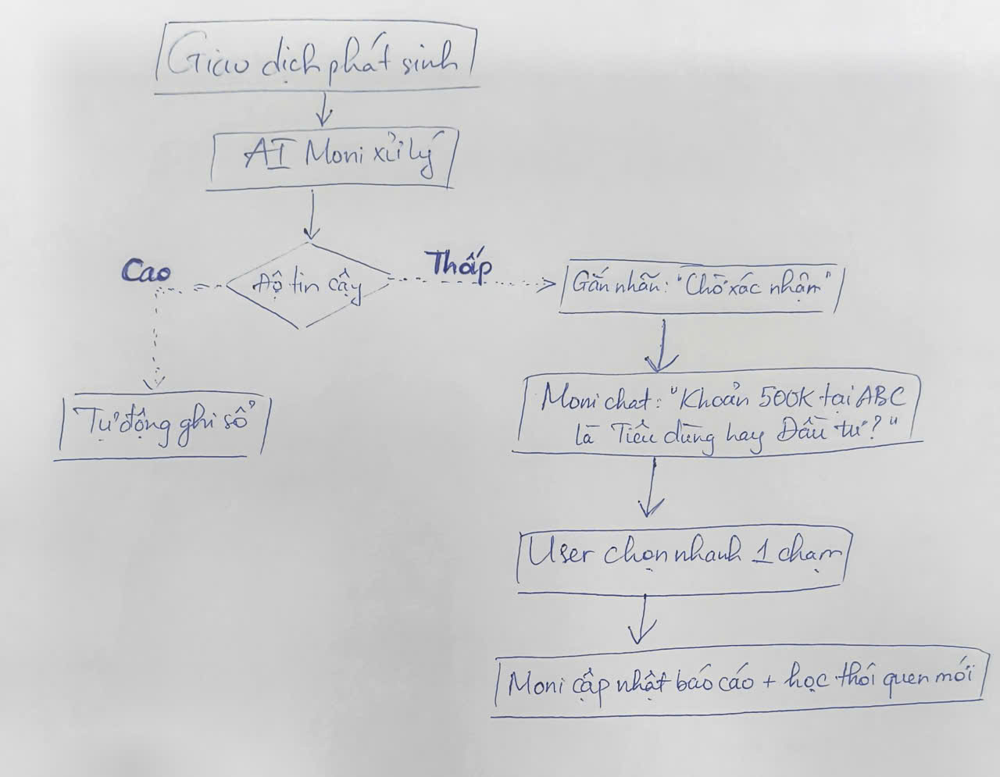

# Bài tập UX: Phân tích sản phẩm AI thật

Phân tích sản phẩm AI Moni của Momo

## Phần 1: Khám phá
### 1. Tìm hiểu Marketing và Lời hứa thương hiệu

Chiến dịch truyền thông của MoMo từ cuối tháng 10/2024 tập trung vào việc định vị lại từ một "Ví điện tử" thành "Trợ thủ tài chính với AI".

Lời hứa sản phẩm:
- Bình dân hóa dịch vụ tài chính: Giúp mọi người Việt quản lý tiền bạc linh hoạt, hiệu quả và xây dựng nền tảng tài chính ổn định.
- Người quản gia tài chính thông thái: Trợ lý Moni được hứa hẹn là một chuyên gia tỉ mỉ, thân thiện, không phán xét, giúp biến việc quản lý tài chính từ gánh nặng thành thói quen đơn giản.
- Tự động hóa hoàn toàn: Hệ thống cam kết tự động ghi chép, phân loại chi tiêu với độ chính xác cao và đưa ra các cảnh báo thông minh khi người dùng sắp vượt ngân sách.
- Giao diện gần gũi: Sử dụng phong cách vẽ minh họa và chữ viết tay để tạo cảm giác thân thiện hơn với người dùng

### 2. Trải nghiệm thực tế và quan sát hệ thống

Khi trực tiếp sử dụng các tính năng AI, các thay đổi về UI và phản ứng của hệ thống được thể hiện rõ nét:
- Truy cập và UI thay đổi:
    - Tại giao diện chính, xuất hiện một khu vực dành riêng có tên "Trợ thủ AI - Moni".
    - Giao diện thay đổi theo hướng cá nhân hóa, cho phép người dùng chọn "Xem thêm" để mở rộng các công cụ quản lý thay vì hiển thị tất cả cùng lúc gây rối mắt.
    - Hệ thống xuất hiện các biểu đồ báo cáo tuần/tháng trực quan thay vì chỉ là các dòng lịch sử giao dịch khô khan

- Sự xuất hiện/biến mất của các nút chức năng:
    - Nút "Phân tích chi tiêu": Xuất hiện nổi bật trong giao diện Moni để người dùng xem nhanh các nhóm chi tiêu (ăn uống, mua sắm...).
    - Nút "Thêm giao dịch": Cho phép nhập thủ công các khoản chi ngoài hệ thống MoMo, giúp AI có dữ liệu toàn diện hơn.
    - Nút "Tạo ngân sách": Xuất hiện khi người dùng muốn thiết lập giới hạn chi tiêu.
    - Khung chat thông minh: Thay thế cho các menu chọn lệnh cứng nhắc trước đây, cho phép nhập câu lệnh bằng ngôn ngữ tự nhiên.

- Phản ứng của AI:
    - Khả năng đối thoại linh hoạt: Thay vì phản hồi theo kịch bản (rule-based), Moni sử dụng AI tạo sinh để hiểu ngôn ngữ đời thường.
    - Chủ động nhắc nhở: AI không chỉ phản hồi khi được hỏi mà còn chủ động gửi thông báo khi người dùng sắp tiêu quá số tiền đã đặt ra
    - Phân loại tự động: Ngay sau khi thanh toán, AI phản ứng tức thì bằng cách gán giao dịch vào một danh mục cụ thể và cập nhật vào sổ chi tiêu mà không cần người dùng thao tác thêm.

## Phần 2: Phân tích 4 paths

> ***Path 1. Khi AI đúng: User thấy gì? Hệ thống confirm thế nào?***

- Trải nghiệm người dùng: Người dùng sẽ thấy các khoản chi tiêu được tự động ghi chép và phân loại vào các danh mục cụ thể như ăn uống, mua sắm, di chuyển ngay sau khi phát sinh giao dịch trên MoMo. Hệ thống sẽ hiển thị các báo cáo tuần/tháng trực quan và biểu đồ phân tích giúp người dùng nhìn rõ thói quen chi tiêu của mình.
- Xác nhận từ hệ thống: MoMo xác nhận thông qua các thông báo đẩy (push notification) khi người dùng sắp hoặc đã vượt ngân sách thiết lập. Ngoài ra, Moni xác nhận các yêu cầu truy vấn thông tin (ví dụ: "Tháng này tôi tiêu bao nhiêu cho mua sắm?") bằng cách trả về số liệu chi tiết ngay trong khung chat.

> ***Path 2. Khi AI không chắc: Hệ thống xử lý thế nào?***
- Xử lý hội thoại: Moni không chỉ phản hồi theo kịch bản cứng nhắc mà có khả năng đối thoại linh hoạt. Khi gặp câu hỏi chưa rõ ý, Moni đóng vai trò là một "người quản gia" kiên nhẫn để hiểu ngôn ngữ đời thường của người dùng.
- Hỗ trợ nhập liệu thủ công: Đối với các giao dịch ngoài hệ thống MoMo mà AI không thể tự thu thập, hệ thống cung cấp tính năng "Thêm giao dịch" thủ công để người dùng tự bổ sung vào sổ chi tiêu.

> ***Path 3. Khi AI sai: User biết bằng cách nào? Sửa bằng cách nào?***
- Cách nhận biết: Người dùng có thể phát hiện sai sót khi kiểm tra mục "Phân tích chi tiêu" hoặc "Sổ chi tiêu" và thấy các giao dịch bị phân loại nhầm danh mục.
- Quy trình sửa lỗi: Người dùng có thể chủ động chỉnh sửa với 3 bước đơn giản: (1) Vào "Sổ chi tiêu", (2) Chọn thẻ danh mục hoặc giao dịch cần sửa, (3) Chọn "Tạo mới" hoặc phân loại lại theo nhu cầu. Hệ thống cho phép người dùng tùy chỉnh danh mục chi tiêu riêng để tăng độ chính xác theo ý muốn.
- Rủi ro tiềm ẩn: Tài liệu cũng cảnh báo về hiện tượng "ảo giác AI", nơi chatbot có thể bịa đặt thông tin tài chính hoặc trích dẫn sai lệch một cách rất thuyết phục.

> ***Path 4. Khi user mất tin: Có exit không? Có fallback không?***
- Lối thoát và Fallback: Nếu không hài lòng với trợ lý AI, người dùng có thể tìm đến các kênh hỗ trợ truyền thống ngay trong mục "Trợ giúp". Các lựa chọn fallback bao gồm:
    - Hotline CSKH 24/7(có phí)
    - Gửi yêu cầu hỗ trợ: Ngay trên ứng dụng thông qua tính năng "Trợ giúp"
    - Email hỗ trợ

- Độ dễ tìm: Các kênh này được bố trí trong Trung tâm trợ giúp của ứng dụng, tuy nhiên MoMo ưu tiên khuyến khích dùng Chat AI trước để giảm tải cho tổng đài.

--------------------------------------------------------------------------------
*Tự phân tích và Đánh giá*

**Path xử lý tốt nhất:** Path 1 (Khi AI đúng). Việc tự động hóa hoàn toàn luồng ghi chép và phân loại giao dịch trong hệ sinh thái MoMo là điểm mạnh nhất. Nó giải quyết đúng "nỗi đau" ngại ghi chép thủ công của người dùng, biến dữ liệu khô khan thành báo cáo có ích một cách tức thì.

**Path yếu nhất:** Path 3 (Khi AI sai). Mặc dù cho phép sửa, nhưng việc phải kiểm tra lại tính chính xác của AI vẫn tạo ra friction (ma sát) cho người dùng. Đặc biệt, hiện tượng "ảo giác AI" là một thách thức kỹ thuật chưa có lời giải tuyệt đối, có thể gây ra sự nhầm lẫn nghiêm trọng trong việc tư vấn tài chính nếu người dùng quá tin tưởng.

*Kỳ vọng Marketing vs. Thực tế:*

**Khớp:** Marketing hứa hẹn về một "Trợ thủ" gần gũi, thông minh và thực tế Moni đã làm tốt việc cá nhân hóa, đối thoại tự nhiên hơn các chatbot cũ.

**Gap (Khoảng cách):** Marketing định vị đây là "Trợ thủ tài chính với AI" mang lại sự tiện lợi, nhưng phản hồi từ cộng đồng (như trên Tinhte) cho thấy ứng dụng đôi khi còn nặng, lag, và giao diện bị nhồi nhét quá nhiều, gây rối mắt. Ngoài ra, việc hotline vẫn tính phí (1.000đ/phút) là một điểm trừ khi người dùng cần hỗ trợ khẩn cấp sau khi mất niềm tin vào hệ thống tự động

## Phần 3: Sketch
*PATH 3: KHI AI SAI (ERROR HANDLING)*

|As-is (Hiện tại)| To-be (Đề xuất)|
|---|---|
|1. AI tự động ghi chép và phân loại giao dịch (nhưng bị sai hoặc gặp ảo giác)| 1. AI phân loại giao dịch kèm theo Chỉ số tin cậy (Confidence Score).|
|2. User phải chủ động vào mục "Sổ chi tiêu" hoặc "Phân tích" để kiểm tra.| 2. Hệ thống chủ động highlight các giao dịch có độ tin cậy thấp hoặc có dấu hiệu bất thường.|
|3. [CHỖ GÃY]: User tốn công sức (cognitive load) để phát hiện lỗi sai trong hàng chục giao dịch.| 3. Moni gửi thông báo: "Mình thấy giao dịch này lạ, có phải bạn chi cho [Danh mục X] không?"|
|4. User bấm vào giao dịch -> Chọn sửa -> Chọn danh mục mới (quy trình 3 bước thủ công).| 4. User chỉ cần nhấn "Đúng" hoặc chọn "Gợi ý khác" ngay tại khung chat hoặc thông báo.|
|5. User cảm thấy nghi ngờ độ chính xác của báo cáo tổng thể.| 5. Hệ thống học từ phản hồi (RLHF) để không lặp lại lỗi sai đó lần sau.|

**Flow đề xuất:**

**CHI TIẾT THAY ĐỔI (FLOW DESIGN)**

*1. Thêm gì?*

- Nhãn "Cần xác nhận" (Verification Tag): Đối với các giao dịch AI không chắc chắn (ví dụ: một cửa hàng mới hoặc giao dịch có tên lạ), hệ thống sẽ gắn nhãn màu vàng trong sổ chi tiêu thay vì tự ý phân loại hoàn toàn.
- Cơ chế "Self-Correction" qua Chat: Moni chủ động hỏi người dùng về các khoản chi dễ gây nhầm lẫn thay vì đợi người dùng phát hiện ra lỗi.

*2. Bớt gì?*

- Bớt các bước điều hướng sâu: Loại bỏ việc người dùng phải "lặn lội" vào 3-4 lớp menu bên trong "Quản lý chi tiêu" chỉ để sửa một danh mục bị sai.

*3. Đổi gì?*

- Từ "Rà soát thụ động" sang "Xác nhận chủ động": Thay vì để người dùng đi tìm lỗi, hệ thống mang những "nghi ngờ" của AI ra hỏi người dùng.
- Đổi cách hiển thị báo cáo: Nếu trong tháng có nhiều giao dịch AI chưa chắc chắn, báo cáo tổng sẽ hiển thị ghi chú: "Báo cáo này có 5% dữ liệu chờ bạn xác nhận để chính xác hơn".